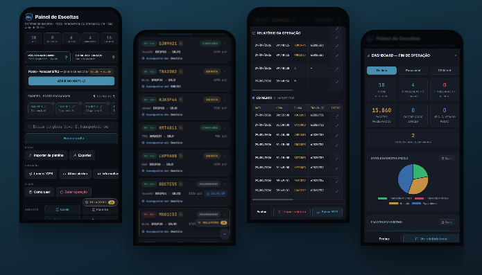

# Seja bem-vindo ao meu GitHub 👋

- 💻 Desenvolvedor Front-End com foco na construção de interfaces funcionais, sistemas operacionais internos e dashboards analíticos.
- 🎓 Cursando Sistemas de Informação (FMU) · Formado em Análise e Desenvolvimento de Sistemas (UNIP).
- ⚙️ Apaixonado por transformar regras de negócio complexas em ferramentas simples, eficientes e intuitivas para o dia a dia.
- 🚀 Experiência prática no desenvolvimento de soluções completas com JavaScript, integração de APIs, automação de dados e relatórios gerenciais.

📌 Principais Projetos

Painel de Escoltas & Monitoramento 

Na logística, saber quem chegou ao ponto de encontro, quem já saiu em rota e quando cada veículo chega ao destino faz toda a diferença. Foi para isso que nasceu o Painel de Escoltas.

### O que o projeto resolve

- 📍 **Rastreamento por localização:** Calcula a posição e a estimativa de chegada a partir de latitude e longitude, usando rota real por rodovia.
- ⏱️ **Controle do ponto de encontro:** Contagem regressiva do tempo limite no ponto de encontro, com alertas de atraso.
- 👥 **Gestão de equipes:** Acompanhamento da situação de cada escolta (aguardando, no ponto, em rota e concluída).
- 📊 **Dados da planilha:** Importação da planilha de controle e exportação rápida dos dados operacionais.
- 📑 **Relatórios gerenciais:** Dashboard e relatório de fim de operação, com PDF e texto pronto para o grupo.

